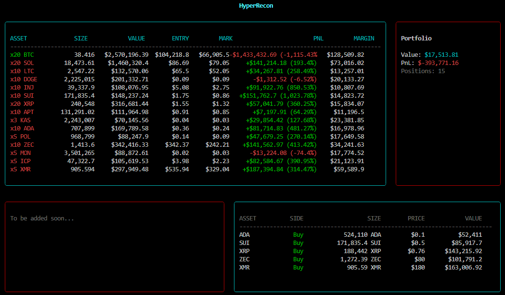

# HyperRecon

A personal tool to track crypto wallets of top traders and scrape live trade signals from social media & produce aggregated market sentiment

Uses react + ink for CLI UI and raw Bun/TS for interaction

    


To install dependencies:

```bash
bun install
```

To run:

```bash
bun run index.ts
```

This project was created using `bun init` in bun v1.2.20. [Bun](https://bun.com) is a fast all-in-one JavaScript runtime.
